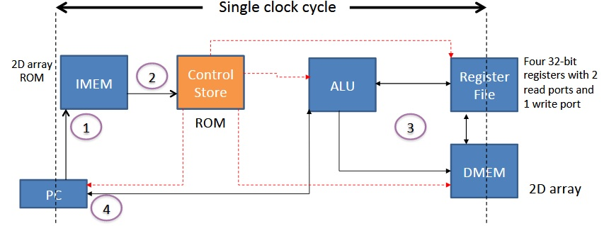

# Simple Microcontroller Design
\
\

**Compute instructions:** 
\
ADD, MULT, SHL, SHR –Read register file (RF) for operand(s), and write result to the register file.
\
**Memory access instructions:** 
\
LD, ST –Move data between the register file and the data memory (DMEM).
\
**Control flow instructions:** 
BR (branch)–Read register file (RF) for operands. Based on the outcome of comparing the operand data, redirect program counter (PC=offset), or continue sequential execution (PC=PC+1).
