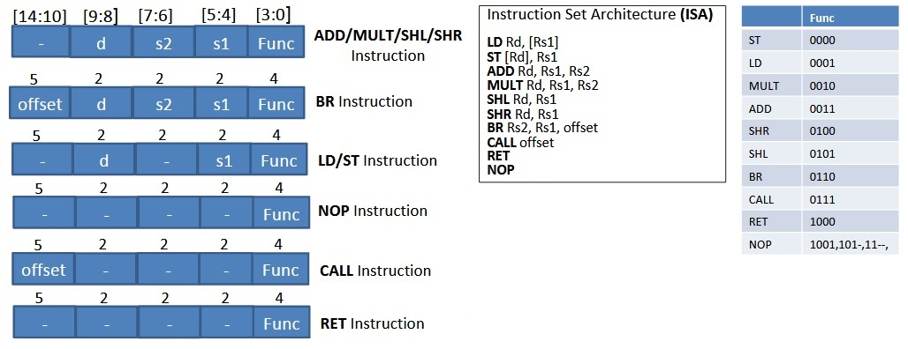

# Simple Microcontroller Design
\
\

+ **Compute instructions: (ADD, MULT, SHL, SHR)** 
\
Read register file (RF) for operand(s), and write result to the register file.

+ **Memory access instructions: (LD, ST)** 
\
Move data between the register file and the data memory (DMEM).

+ **Control flow instructions:** 
\
BR (branch)–Read register file (RF) for operands. Based on the outcome of comparing the operand data, redirect program counter (PC=offset), or continue sequential execution (PC=PC+1).
\
CALL, RET –CALL: Save PC+1 into link register, all registers into stack memory, and set PC=offset –RET: Restore registers from stack memory ,and load program counter from the link register.

--------------------------------------------------------------------------------------
**Instruction Encodings:**
\
\
Instruction Data [31:0] from IMEM: (bits [31:15] are not used).
\
\

+ LD takes Rs1 register data as DMEM address, and loads the value from DMEM into Rd register. 

+ ST takes Rd register data as DMEM address, and writes the value from Rs1 register into the DMEM location. 

+ ADD and MULT take Rs1 and Rs2 register data as operands, compute the add or multiply, and write the result back into Rd register. 

+ SHL and SHR take Rs2 register data, shift it left or right by 1 bit, fill empty bit with 0, and write the result back into Rd register. 

+ BR takes Rs1 and Rs2 register data and compare them. If the data in Rs2 is less than the data in Rs1, it redirects the PC to the offset bits. Otherwise, the PC is incremented sequentially (i.e., PC+1). 

+ CALL saves PC+1 (address of next instruction) into link register, saves all register file’s four registers into stack memory, and sets the PC to offset bits. 

+ RET restores the four registers from the stack memory, and sets PC to the contents of the link register.

+ NOP does not update any state (register file or DMEM) in the machine.

